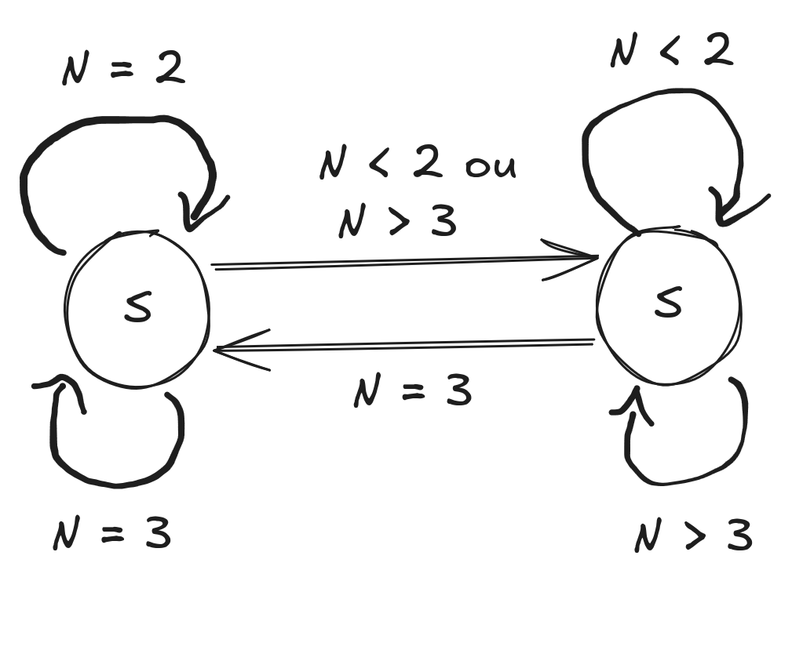

Esse projeto é uma implementação do clássico autômato celular **Game of Life**, desenvolvida em **C++17** com a biblioteca gráfica **[Raylib](https://www.raylib.com/)** e compilada para a Web através de **WebAssembly (Emscripten)**.

👉 **[Clique aqui para jogar direto no navegador!](https://launzoa.github.io/game-of-life/)**

---

## Sobre o Projeto

 A ideia desse projeto surgiu durante a minha leitura do livro "Artificial Inteligence: Principles and Pratice" do George F. Luger — mais especificamente a seção "3.4 Artificial Life: The Emergence of Complexity", onde o autor introduz o Game of Life. 
 
 Meu objetivo com o projeto era praticar os conhecimentos do livro, bem como os meus conhecimentos de computação gráfica em **C++,** utilizando a biblioteca **Raylib**.

---

## Game of Life de Conway

O *Game of Life* (Jogo da Vida) foi criado pelo matemático britânico John Horton Conway em 1970. Trata-se de um autômato celular bidimensional, conhecido como um "jogo com zero jogadores", onde a evolução do sistema é determinada somente pelo seu estado inicial. 

O jogo consiste de quatro regras simples para modelar a "vida artificial" de uma célula nas próximas gerações:
1. **Reprodução:** Uma célula morta que possua exatamente 3 vizinhos vivos torna-se viva na geração seguinte.
2. **Sobrevivência:** Qualquer célula viva que possua 2 ou 3 vizinhos vivos permanece viva na geração seguinte. 
3. **Isolamento:** Qualquer célula viva que possua menos de 2 vizinhos vivos morre na próxima geração, i.e., a densidade populacional ao redor é insuficiente/esparsa para suportar a vida.
4. **Superlotação:** Qualquer célula viva que possua mais de 3 vizinhos vivos morre na próxima geração, i.e., a densidade populacional  ao redor é excessiva para suportar a vida.

O comportamento de cada célula pode ser formalizado através de uma **Máquina de Estados Finita (FSM)**, como descrito a seguir.

---

## Modelagem por Máquina de Estados Finita (FSM)

Cada célula pode ser vista como um autômato que transita entre dois estados possíveis: **`ALIVE` (Viva)** e **`DEAD` (Morta)**, com base na contagem de vizinhos vivos em sua vizinhança de Moore (as 8 células adjacentes), assim como nas 4 regras citadas anteriormente:



---

## Controles

| Entrada                     | Ação                                            |
| :-------------------------- | :---------------------------------------------- |
| **Botão Esquerdo do Mouse** | Pinta / Alterna o estado da célula (viva/morta) |
| **Espaço (`SPACE`)**        | Inicia / Pausa a simulação contínua             |
| **Enter (`ENTER`)**         | Avança exatamente 1 geração (quando pausado)    |
| **Tecla `C`**               | Limpa todo o tabuleiro                          |

---

## Estrutura das Branches

O repositório é organizado em duas branches principais:

* **[`main`](https://github.com/launzoa/game-of-life):** Contém o código-fonte C++ puro, o sistema de build em CMake e o template responsivo da web (`shell.html`).
* **[`gh-pages`](https://github.com/launzoa/game-of-life/tree/gh-pages):** Dedicada para hospedagem estática no GitHub Pages contendo somente os códigos WebAssembly gerados (`index.html`, `index.js`, `index.wasm`) por meio do emsdk.

---

## Como Compilar e Executar Localmente

### Pré-requisitos
* Compilador C++17 (GCC, Clang ou MSVC)
* CMake (>= 3.16)

---

### 1. Versão Nativa Desktop (Linux)
Requer a biblioteca `raylib` instalada no sistema.

```bash
# Configura o projeto
cmake -B build
# Compila o executável nativo
cmake --build build
# Executa o jogo
./build/app
```

---

### 2. Versão WebAssembly (Web / Navegador)
Requer o [emsdk (Emscripten)](https://github.com/emscripten-core/emsdk) instalado e ativo no terminal.

```bash
# Configura com o compilador Emscripten (baixa o Raylib Web automaticamente)
emcmake cmake -B build-web -DPLATFORM=Web
# Compila para WebAssembly (.wasm, .js, .html)
cmake --build build-web
# Inicia um servidor HTTP local para testar
python3 -m http.server 8080 --directory build-web
```
Acesse `http://localhost:8080` no seu navegador.

---

Desenvolvido por **[launzoa](https://github.com/launzoa)**.
